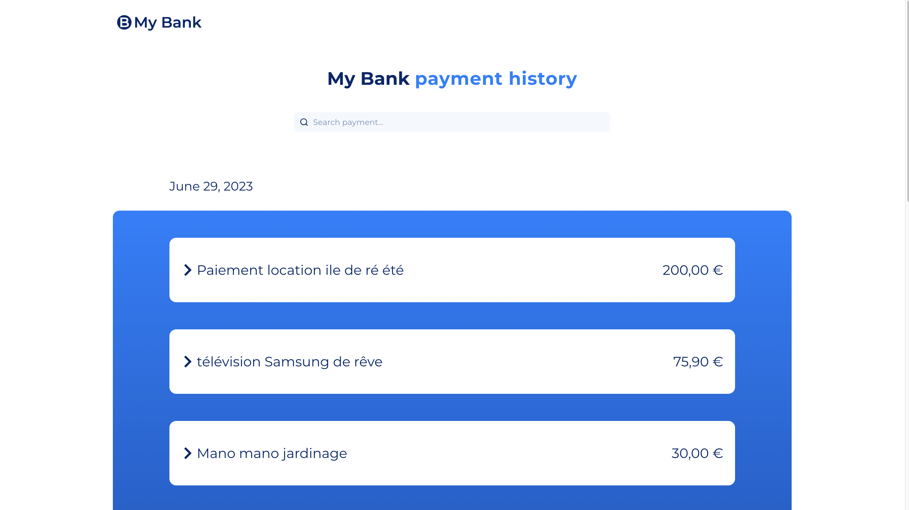
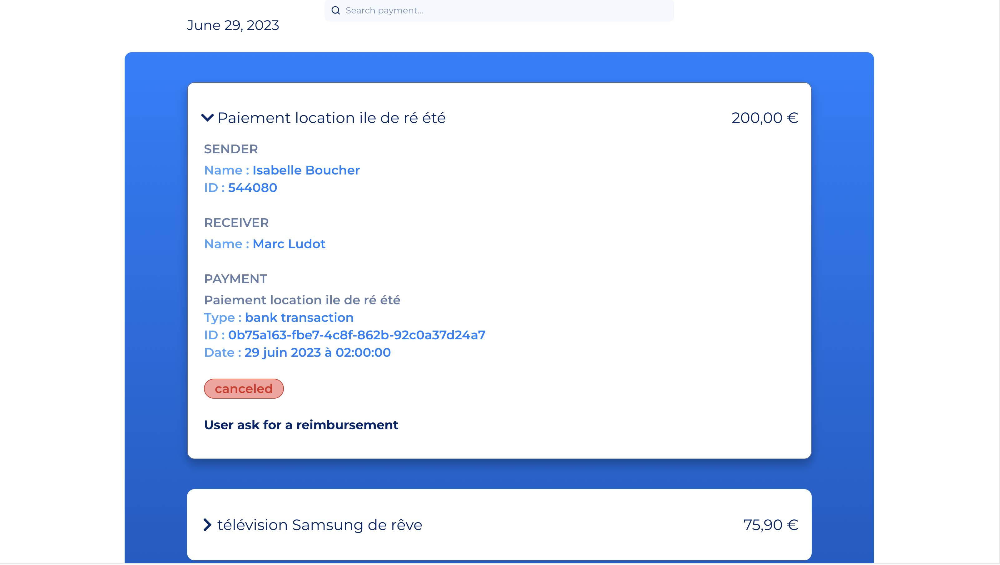

# ⚙️ Test technique ⚙️

Mise en pratique de TypeScript avec une application Front-end.
Projet déployé sur [Netlify](https://www.netlify.com/) et consultable à l'adresse : https://superlative-alpaca-5fe2a1.netlify.app/

---

## 📌 Description

Création d'une application SPA, pour Single Page Application, permettant la recherche d'une transaction spécifique via son label.
Une barre de recherche est dédiée à cet effet.





---

## 🏗️ Technologies utilisées

- **React** — Framework principal.
- **TypeScript** — Pour un code mieux défini et une meilleur expérience développeur.
- **Tailwind CSS** — Librairie servant à concevoir l'interface utilisateur du site.
- **Responsive Design** — Site conçu selon la méthode "Mobile First" et entièrement **_responsive_**.

---

## 🚀 Installation

### Prérequis

- npm ou yarn

### Étapes

1. Cloner le dépôt :

```bash
git clone https://github.com/julienb84/Technical-app.git
```

2. Installer les dépendances :

```bash
npm install
# ou
yarn
```

3. Lancer le projet en mode développement :

```bash
npm run dev
# ou
yarn dev
```

Un serveur de développement se lancera et l’application sera accessible à l’adresse : http://localhost:5173.

---

## 📄 License

Ce projet est un test technique. Il n’est pas destiné à un usage commercial.

---

## 📡 Contact

- Julien Bouchez : julienbouchez@icloud.com
- Profile GitHub : [@JulienBouchez](https://github.com/julienb84)
- Profile LinkedIn : [@JulienBouchez](https://www.linkedin.com/in/julien-bouchez-developer/)
